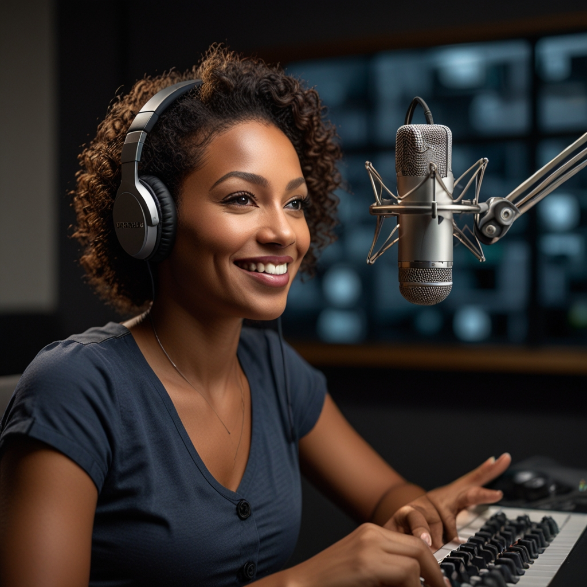

🎙️ **Ouça o Podcast**:
[Ciber Café no Spotify - A Realidade por Trás da Tela](https://link-do-seu-podcast.com)

# Projeto Podcast Gerado por I.A.s

 > ℹ️ **NOTE:** Projeto com o objetivo de gerar um podcast utilizando ferramentas de IA através de prompts mais trabalhado.

## 💻 Tecnologias utilizadas no projeto

- [ChatGPT](https://www.openai.com/chatgpt) - Modelo de linguagem de inteligência artificial desenvolvido pela OpenAI.
- [LeonardoAI](https://www.leonardo.ai) - Plataforma de IA para geração de imagens e outras aplicações.
- [ElevenLabs](https://www.elevenlabs.io) - Plataforma de inteligência artificial focada em voz.
- [Capcut](https://www.capcut.com) - Editor de vídeo com recursos baseados em IA.

## 🧠 Prompts

ChatGPT：

|   Ação   | prompt                                                                                                                                                                                                                                                                         |
| :------: | ------------------------------------------------------------------------------------------------------------------------------------------------------------------------------------------------------------------------------------------------------------------------------ |
|  título  | Você é um roteirista de podcast, e vamos criar um roteiro de um podcast de tecnologia, focado em cibersegurança cujo o nome é "Café com Ciber: A Realidade por Trás da Tela" e tem foco em cibersegurança, com o público alvo de iniciantes em cibersegurança.
|          | O podcast vai falar sobre dicas e segurança sobre o mundo da cibersegurança e o que está acontecendo no mundo global.
| {REGRAS} | •	O nome deve ser enxuto, um nome e um subtítulo •	O nome tenha algum trocadilho sobre Mr.Robot •	O nome deve conter alguma palavra forte que remeta a cibersegurança. 
|{REGRAS NEGATIVAS}| • Não quero que o título contenha palavras em inglês

 ## 🧠 Prompts

|  Ação  | prompt                                                                                 |
| :----: | -------------------------------------------------------------------------------------- |
| conteúdo | Você é um roteirista de podcast, e vamos criar um roteiro de um podcast de tecnologia, focado em futuro do mercado de trabalho em função da Inteligência Artificial cujo o nome é " Código das Bruxas: Revelando a alquimia entre IA e o mercado de trabalho" e tem foco em inteligência artificial, com o público alvo de pessoas que já estão atuando no mercado de trabalho hoje. O formato do roteiro deve ser [INTRODUÇÃO] [CURIOSIDADE 1] [CURIOSIDADE 2] [FINALIZAÇÃO]
| {REGRAS} | •	no bloco [INTRODUÇÃO] substitua por uma introdução animada e simpática •	no bloco [CURIOSIDADE 1] substitua por uma curiosidade sobre inteligência artificial •	no bloco [CURIOSIDADE 2] substitua por profissões que provavelmente serão mais necessárias no futuro em função da inteligência artificial •	no bloco [FINALIZAÇÃO] substitua por uma despedida cool com o final 'Eu sou a Manoela e esse foi o Alquimiacast dessa semana' •	use termos de fácil explicação •	O podcast vai ser apresentado somente por uma pessoa, chamada Manoela •	O podcast deve ser curto 
|{REGRAS NEGATIVAS}| •	Não use muitos termos técnicos •	Não ultrapasse 5 minutos de duração  

|  Ação  | prompt                                                                                 |
| :----: | -------------------------------------------------------------------------------------- |
|  capa  | A radiant black woman, 34 years old, with long, curly voluminous hair, a thin nose, almond-shaped eyes, and full lips, smiling warmly as she looks directly into the camera. She's sitting in a professional podcast studio, wearing sleek headphones positioned securely in her ears. A steaming cup of coffee sits directly in front of you on the table, perfectly aligned in the foreground, with delicate clouds of steam visibly rising. The desk also has a high-quality microphone positioned next to it, along with modern podcasting equipment like a mixer and digital monitors subtly visible in the background. The studio is designed with sleek soundproof panels, bright LED accents, and a modern aesthetic. Dynamic cinematic lighting, with soft backlighting and warm highlights, accentuates the face and realistic textures of the scene. Captured with professional camera settings (f/8, 1/100s, ISO 100), the image is ultra-detailed, photorealistic and processed at 16K resolution. The composition ensures that both the woman and the coffee cup are central, creating a balanced and engaging view. Presented in a 1:1 ratio --ar 1:1 --v 5.2 

## ✨ Como foi feito ?

- Roteiro gerado via chatgpt
- Audio gerado pela elevenLabs
- LeonardoAI para gerar capa
- Capcut para tratar aúdio e adicionar sons de fundo

